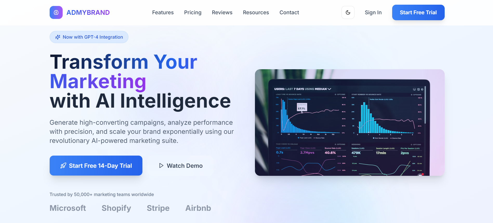
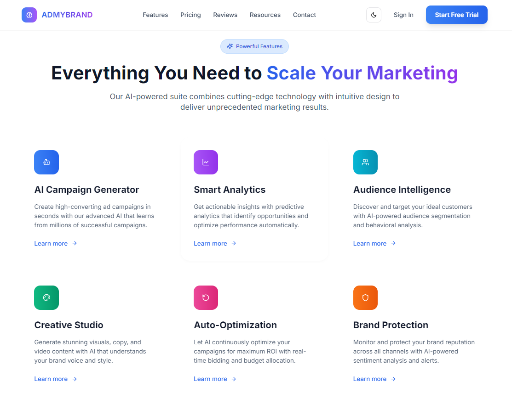
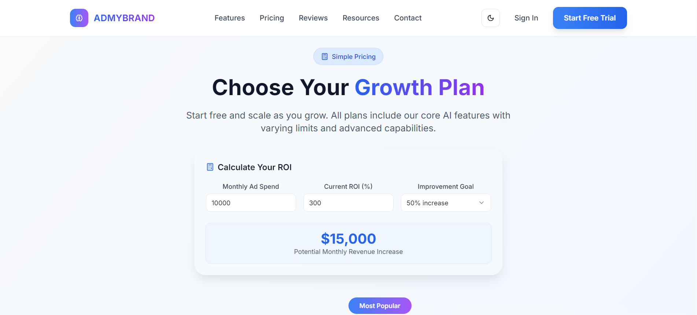
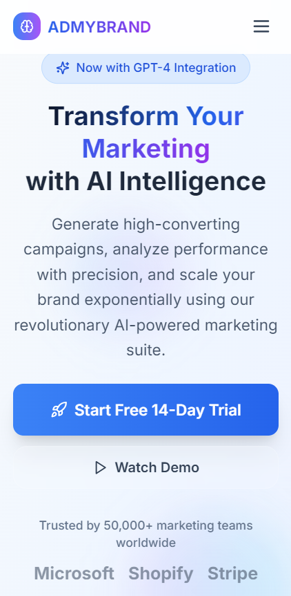

# ADMYBRAND AI Saas-Landing-Page 🚀



A sleek, animated SaaS landing page for **ADMYBRAND AI Saas-Landing-Page** — an AI-powered marketing tool. Built using **Next.js**, **TypeScript**, **Tailwind CSS**, and **Framer Motion**, this project focuses on design-first development with smooth animations, responsive layouts, and reusable component architecture.

---

## 📸 Screenshots

### 🌟 Hero Section & Navigation  


### ✨ Feature & Pricing Cards  
 
(./public/pricing2.png)

### 📱 Mobile Responsive Layout  


---

## 🧠 Key Features

- ⚛️ **Next.js 14 (App Router)**: File-based routing, SSR/ISR/SSG ready  
- 🟦 **TypeScript**: Full type-safety across the project  
- 💨 **Tailwind CSS**: Utility-first, responsive styling with custom themes  
- 🎬 **Framer Motion**: Page transitions, animations, and scroll effects  
- 🧩 **shadcn/ui + Radix UI**: Accessible, headless components  
- 🌗 **Dark Mode Support**: Switch themes using CSS variables  
- 🌐 **Client-side Routing**: Built-in via Next.js  
- ⚡ **Optimized Performance**: Lazy loading, dynamic imports, static optimization  
- 📱 **Mobile-First Design**: Fully responsive components  
- 🎯 **Reusable Component Library**: Custom and shadcn-based components  
- 🧪 **Form Validation**: React Hook Form + Zod schema integration  

---

## 📁 Tech Stack

| Tech               | Role                             |
|--------------------|----------------------------------|
| **Next.js 14+**     | Framework (App Router)           |
| **React 18**        | UI Library                       |
| **TypeScript**      | Static typing                    |
| **Tailwind CSS**    | Styling                          |
| **Framer Motion**   | Animation                        |
| **Radix UI**        | Accessibility primitives         |
| **Lucide Icons**    | Icon set                         |
| **React Hook Form** | Form handling                    |
| **Zod**             | Form validation                  |
| **date-fns**        | Date utility                     |

---

## 🧩 Reusable Components

| Component          | Description |
|--------------------|-------------|
| `GlassCard`        | Transparent, glassmorphism-styled container |
| `GradientButton`   | Colorful buttons with hover effects |
| `FeatureCard`      | Descriptive product features |
| `PricingCard`      | Pricing tiers with badges |
| `TestimonialCard`  | Client feedback + star ratings |
| `AnimatedCounter`  | Count-up animation for stats |
| `AnimatedBadge`    | Icons with float/motion effects |
| `FAQAccordion`     | Interactive Q&A section |
| `StickyNavbar`     | Appears on scroll with fade-in |
| `HeroSection`      | Fullscreen CTA + animation |
| `Footer`           | Responsive footer with dynamic typing text |

---

## 🔧 Installation & Setup

### 1. Clone the repository
```bash
git clone https://github.com/YashPuniwala/Saas-landing-page.git
cd Saas-Landing-Page
```

### 2. Install dependencies
```bash
npm install
```

### 3. Run the development server
```bash
npm run dev
```

Visit **http://localhost:3000** to view the project in your browser.

---

## 🌍 GitHub Repository

🔗 [View on GitHub](https://github.com/YashPuniwala/Saas-landing-page)

## Live Demo

https://saas-landing-page-delta-vert.vercel.app/